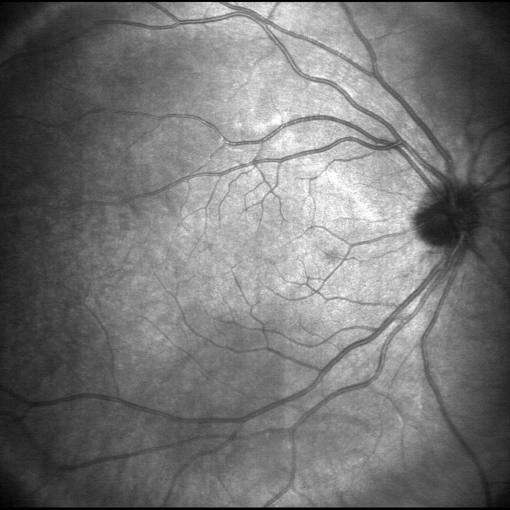

# maia_tool

# Tool to load MAIA microperimetry data 

1) Load x and y coordinates in an excel file to generate a new grid to upload into the MAIA instrument
2) Load points for use with the Nidek MP1 Microperimeter
3) Export MAIA grid 
4) Manually create grid from point and click

This works with either 

or 

