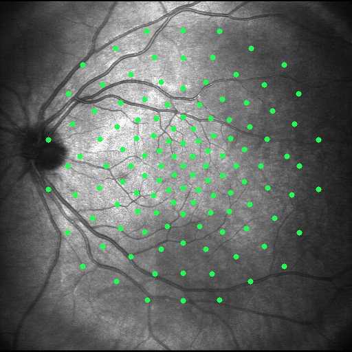

# maia_tool

### Tool to load MAIA microperimetry data 

**Python Dependencies**
`tkinter`
`PyQt5`
`numpy`
`PIL`
`pandas`
`cv2`
`getpass`

1) Load x and y coordinates in an excel file to generate a new grid to upload into the MAIA instrument

**Input Requirements**
- Grid coordinates must be in format `.xlsx` 
- Includes headers for `X` and `Y`
- Coordinates are in degrees and must be < 16 degrees

|X   |Y   |
|----|:---|
|14.2|12.1|
|13.1|07.3|
|04.4|10.8|

2) Load points for use with the Nidek MP1 Microperimeter

### MP1

or 

### MAIA

3) Export MAIA grid 

4) Manually create grid from point and click

- The software also allows for the user to click on the image in the gui to create points through this method
